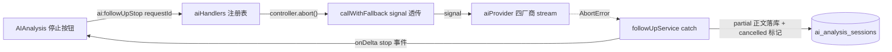

# AI 讨论流式回复「停止生成」

**状态：** 已完成
**日期：** 2026-08-30
**承接：** [`2026-08-11-ai-analysis-agent-hub-design.md`](./2026-08-11-ai-analysis-agent-hub-design.md)（AI 会话与讨论）；[`2026-08-12-agent-turn-session-memory-design.md`](./2026-08-12-agent-turn-session-memory-design.md)
**对应缺口：** 代码分析 P2——深度研究已有取消（`researchAgent:cancelRun`），但普通 AI 讨论（`ai:followUp`）流式生成无停止入口；底层 `AIProviderRequest.signal` 已支持且四厂商接线，仅 fallback/服务层未透传。

## 1. 问题

`ai:followUp` 流式回复一旦开始无法中止：用户发错消息、模型跑题或回复过长时，只能等流式完成（烧 token 且占用会话锁）。深度研究（最贵路径）已有取消，普通讨论（最高频路径）反而没有——体验不对称。

## 2. 目标

1. **可中止：** 流式生成期间，UI 提供「停止」按钮；点击后：
   - 主进程向该请求的 `AbortController` 发中止，底层 provider 流被取消（HTTP 请求终止，不再计费后续 token）；
   - 请求标记为 `cancelled`；**已流出的部分正文按用户操作保留**（作为助手消息落库，尾部标注「（已停止）」），不静默丢弃，符合"不篡改研究账本"的诚实原则；
   - 会话锁正常释放，UI 回到可输入状态。
2. **窄 IPC：** 新增 `ai:followUpStop`（`{ sessionId, requestId }`）；renderer 不接触 AbortController，只能按 requestId 请求停止。
3. **幂等与安全：** 停止未知/已完成 requestId 返回 `{ ok: false, code: 'NOT_RUNNING' }`，不报错不崩；停止操作不能中止非流式路径（web search 整段返回路径无流可停，按钮不出现）。
4. **并发正确：** 停止注册表按 requestId 键控，同会话多请求互不干扰；会话串行锁（`withDiscussionSessionLock`）语义不变——中止发生在锁内请求体上，锁本身照常释放。

## 3. 非目标

- 不做「重新生成」「编辑后重发」（可后续独立 SDD）。
- 不改变量配额/速率限制逻辑。
- 不中止 `ai:agentTurn`（Agent Hub 有自身生命周期，后续单独评估）。
- 不做深度研究取消的改动（已存在）。

## 4. 方案

### 4.1 数据流

1. `callWithFallback` 增加可选 `signal?: AbortSignal` 透传给 `callAIProvider`（四厂商已接线）。跨厂商 fallback 语义：中止视为终态，不尝试下一厂商。
2. `discussionFollowUpService`：`DiscussionFollowUpAICallInput` 增加 `signal`；catch 分支识别 `AbortError`/`user_cancelled`：若已有累计正文则作为助手消息写库（内容尾部追加「（已停止）」），请求状态标 `cancelled`，返回 `{ ok: true, cancelled: true, text: partial, messages }`；无正文则按现有错误路径但 code 用 `CANCELLED`。
3. `aiHandlers.ts`：模块级 `Map<string, AbortController>`（键 `requestId`）；`ai:followUp` 创建 controller 存入，finally 清理；新 handler `ai:followUpStop` 查表 abort。主进程单例重启即清空（内存注册表即可，无需持久化——中止本身是即时操作）。
4. preload：`ai.followUpStop({ requestId })`；`onFollowUpDelta` 已有通道，增加 `type: 'stop'` 事件复用。
5. UI（AIAnalysis.tsx）：流式期间发送按钮切换为「停止」（同位置同宽度，aria-label="停止生成"）；点击调用 `followUpStop`，本地立即把已累计正文渲染为助手消息（等 IPC 返回正式 messages 后以服务端为准覆盖）；`type: 'stop'` 或 `type: 'error'`（code CANCELLED）时收尾。非流式（web search）不显示停止。

### 4.2 消息账本语义

- 用户消息照常落库（发起时已写）。
- 助手消息：有 partial → 落库（尾部「（已停止）」）；无 partial → 不落助手消息，仅请求记录 `cancelled`。
- 不新增表列；复用现有 `ai_analysis_turn_requests`（或等价请求记录）状态字段，新增状态值 `cancelled`（若字段为 CHECK 约束需同步 Migration——实现时确认，若需则新增向前 Migration 159）。

## 5. 验收标准

1. 流式生成中点停止：HTTP 流立即中止（mock AI 延迟场景可测）；UI 恢复可输入；已流出正文作为助手消息可见且带「（已停止）」。
2. 无正文时点停止：不落助手消息；会话可继续对话。
3. 停止后 `withDiscussionSessionLock` 释放：同会话立即发新消息成功。
4. 对已完成请求调 stop：返回 `NOT_RUNNING`，无副作用。
5. fallback 场景：第一个厂商流式中止后不再尝试第二厂商。
6. 单测：注册表 abort、partial 落库、锁释放、NOT_RUNNING 幂等、fallback 不续跑；E2E/契约：UI 按钮出现与点击收尾（mock 流）。
7. `verify` 全绿；AIAnalysis README/FR 更新（FR-0xx 停止生成）。
